# Advanced-Computer-Graphics

Contains images and executables from my year 3 Advanced Computer Graphics module

As per the lecturer's request, all code is hidden in a private submodule

However, I have included the executables in this repository which result in the images as shown below

<table>
  <tr>
    <td><h2 align="center">Reflection</h2></td>
    <td><h2 align="center">Refraction</h2></td>
    <td><h2 align="center">Reflection & Refraction</h2></td>
  </tr>
  <tr>
    <td>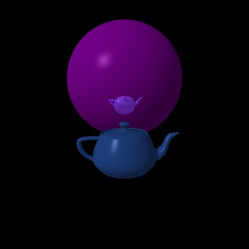</td>
    <td>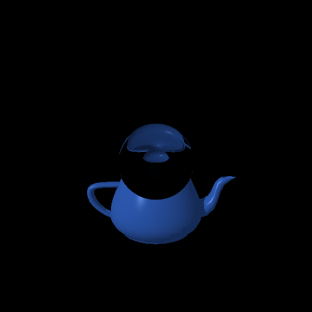</td>
    <td>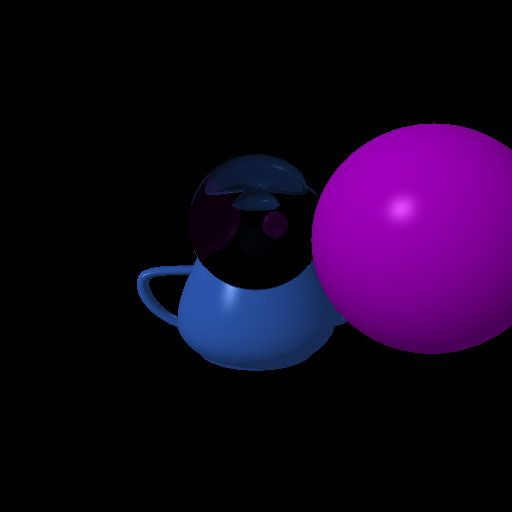</td>
  </tr> 
</table>

<table>
  <tr>
    <td align="center" valign="middle"><h2>Texture Mapping</h2></td>
    <td align="center" valign="middle"><h2>Quadratic Object</h2></td>
  </tr>
  <tr>
    <td>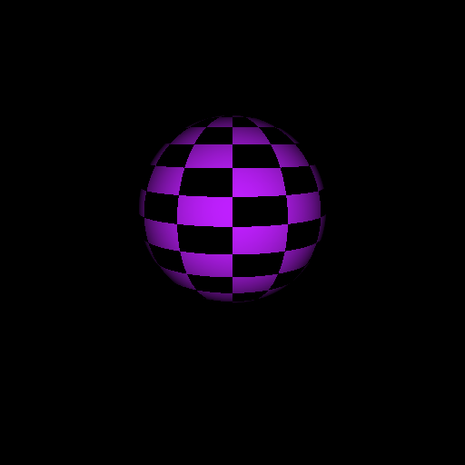</td>
    <td>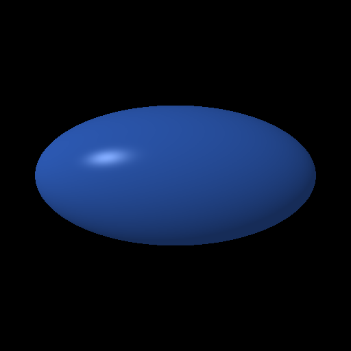</td>
  </tr>
</table>

<table>
  <tr>
    <td colspan="3"><h2 align="center">Constructive Solid Geometry</h2></td>
  </tr>
  <tr>
    <td><h2 align="center">&nbsp;&nbsp;&nbsp;&nbsp;Union&nbsp;&nbsp;&nbsp;&nbsp;</h2></td>
    <td><h2 align="center">&nbsp;Difference&nbsp;</h2></td>
    <td><h2 align="center">Intersection</h2></td>
  </tr>
  <tr>
    <td>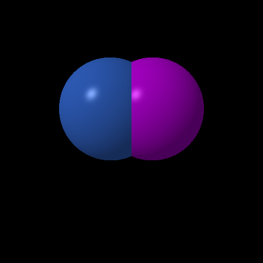</td>
    <td>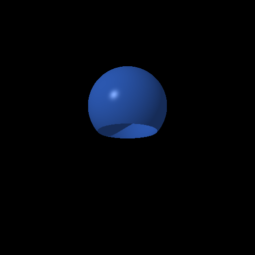</td>
    <td>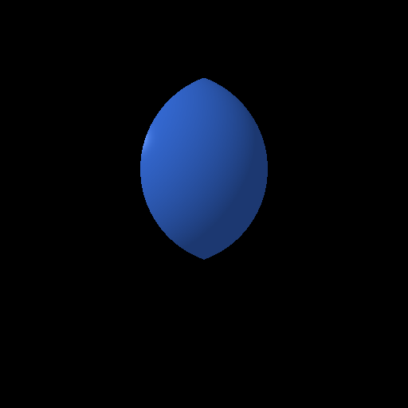</td>
  </tr> 
</table>

<table>
  <tr>
    <td colspan="3"><h2 align="center">Photon Mapping</h2></td>
  </tr>
  <tr>
    <td align="center" valign="middle"><h2>Basic Photon Map</h2></td>
    <td align="center" valign="middle"><h2>Basic Photon Map with Colour</h2></td>
    <td align="center" valign="middle"><h2>Photon Mapping with Raytracing</h2></td>
  </tr>
  <tr>
    <td>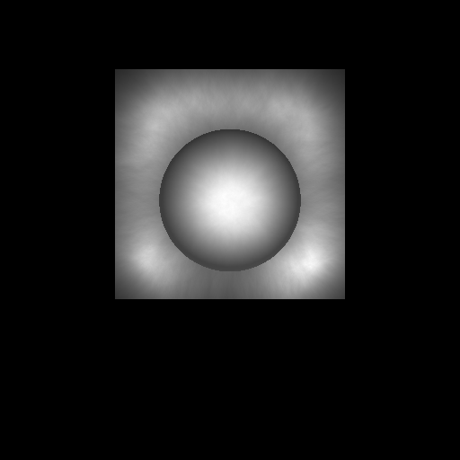</td>
    <td>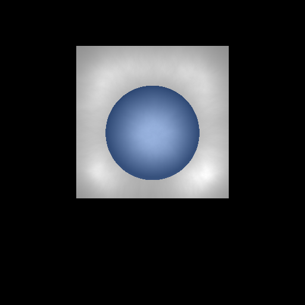</td>
    <td>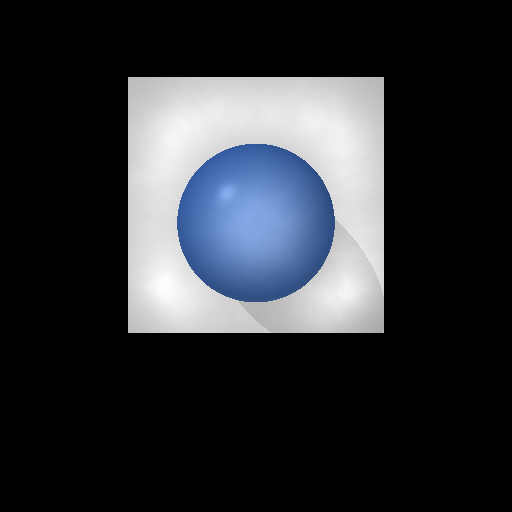</td>
  </tr>
</table>

<table>
  <tr>
    <td><h2>Final Image Produced</h2></td>
  </tr>
  <tr>
    <td>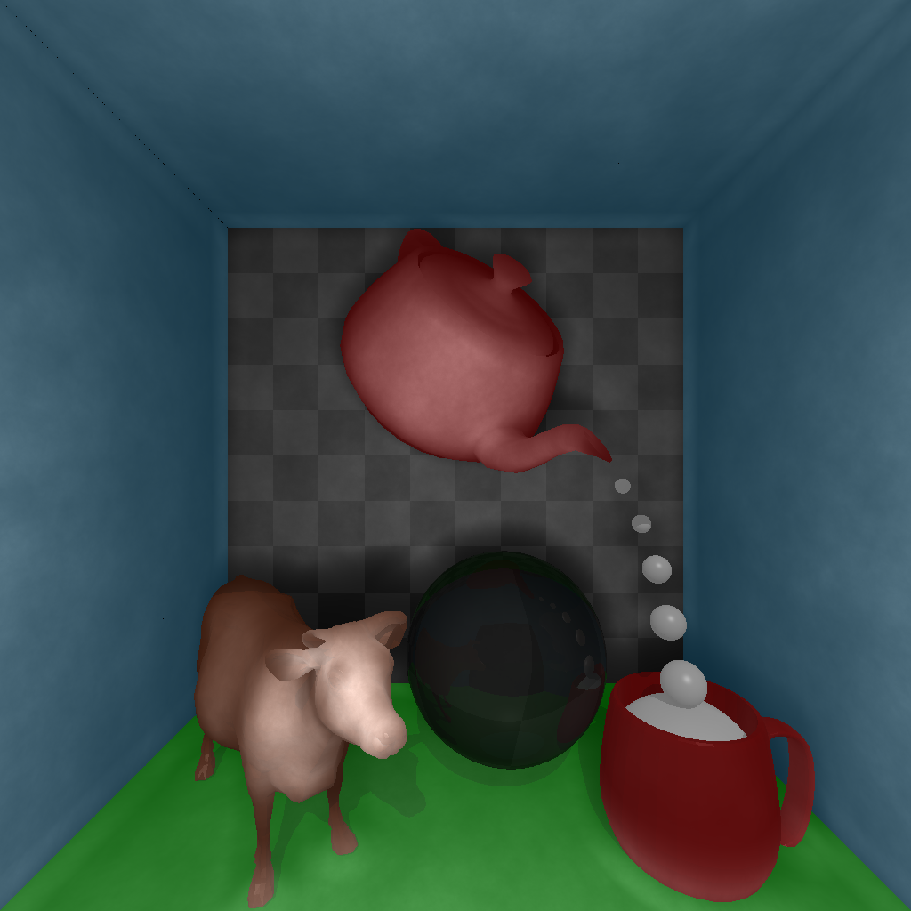</td>
  </tr>
</table>

